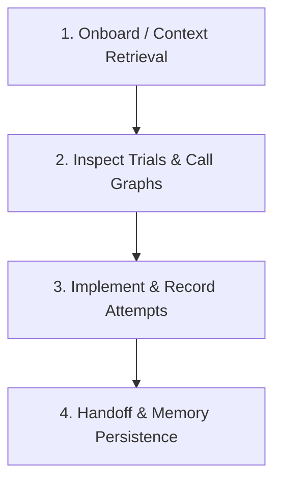

# Second Brain — Agent Operating Guide

The **Second Brain** is your external, persistent cognitive architecture. It unifies structured memory, vector retrieval, knowledge graphs, and cross-agent telemetry across multiple codebases.

When you work on any codebase connected to Second Brain, you are not starting from scratch: you have access to the cumulative decisions, lessons, architectural diagrams, call graphs, and trial history of all preceding AI agents and developers.

---

## 1. Core Architecture & Storage Engines

| Layer | Technology | Primary Role for AI Agents |
| :--- | :--- | :--- |
| **Canonical Memory** | **PostgreSQL** | Source of truth for memories, entities, decisions, tasks, attempts, and handoffs. |
| **Vector Engine** | **Qdrant** | Semantic similarity search across 6 specialized collections (`code_symbols`, `declarative`, `procedural`, `episodic`, `documentation`, `agent_memory`). |
| **Knowledge Graph** | **Neo4j** | Structural call graphs (`(:Function)-[:CALLS]->(:Function)`), API route mappings (`(:Endpoint)-[:MAPS_TO]->(:Function)`), and technology dependencies. |
| **Hot Cache** | **Redis** | Active session state, debounce buffers, and fast retrieval caches. |
| **Artifact Store** | **MinIO** | Architectural specs, PRDs, Markdown notes, PNG/SVG diagrams, and UI mockups. |

---

## 2. Standard Agent Lifecycle Workflow

Follow this 4-step protocol on every engineering task:



### Phase 1: Onboarding & Continuity Retrieval (Start of Session)

Before modifying code or guessing architecture, retrieve the existing state:

1. **Get 1-Shot Continuity Snapshot**:
   - **MCP Tool**: `brain_get_continuity_state(repository_id_or_path=".")`
   - **REST API**: `GET /api/v1/bridge/continuity?repo=.`
   - **Yields**: Current uncommitted diffs, active branch, latest handoff notes, open tasks, and recent activity.
2. **Review Previous Engineering Attempts**:
   - **MCP Tool**: `brain_get_attempts(repository_id="...")`
   - **Why**: Learn what strategies failed previously and avoid repeating identical errors.
3. **Assemble Graph-RAG Context**:
   - **MCP Tool**: `brain_get_context(query="your task description", repository_id="...")`
   - **Why**: Simultaneously gathers relevant memories, Neo4j graph subgraphs, past decisions, and tasks.

---

### Phase 2: Navigation & Code Intelligence

Instead of reading hundreds of source files into your context window:

1. **Symbol-Level Code Search**:
   - Search for specific function signatures, method docstrings, and endpoint definitions:
     - `brain_search(query="authenticateUser token refresh", collection="code_symbols")`
2. **Knowledge Graph Traversal**:
   - Trace function call chains, callers/callees, and API endpoint routes:
     - `brain_knowledge_graph(label="Function", id="com.example.service.AuthService.login", depth=2)`
     - `brain_knowledge_graph(label="Endpoint", depth=1)`
3. **Read Architectural Documentation & Diagrams**:
   - Search specs, RFCs, and architecture diagrams:
     - `brain_search(query="OAuth2 token refresh sequence diagram", collection="documentation")`

---

### Phase 3: Trial Execution & Failure Recording (Active Work)

When working through complex refactors, migrations, or debugging:

1. **If an Approach or Test Fails**:
   - **Do NOT silently discard the failure.** Record it so future agents (or yourself in the next prompt) know what happened:
     ```json
     {
       "tool": "brain_record_attempt",
       "args": {
         "agent_name": "claude-code",
         "task_description": "Implement distributed rate limiter",
         "approach": "In-memory Token Bucket filter",
         "status": "FAILURE",
         "error_message": "State lost on multi-instance deployment; Redis connection timeout",
         "lesson_learned": "Must use Redis Lua script for atomic sliding window rate limiting",
         "files_changed": ["src/main/java/com/app/filter/RateLimitFilter.java"]
       }
     }
     ```
2. **If an Approach Succeeds**:
   - Record the working solution:
     ```json
     {
       "tool": "brain_record_attempt",
       "args": {
         "agent_name": "claude-code",
         "task_description": "Implement distributed rate limiter",
         "approach": "Redis Sliding Window Lua script",
         "status": "SUCCESS",
         "lesson_learned": "Sliding window Lua script passed concurrency tests with 10k req/s",
         "files_changed": ["src/main/java/com/app/filter/RedisRateLimiter.java"]
       }
     }
     ```

---

### Phase 4: Session Wrap-Up & Cross-Agent Handoff

When completing your turn or switching tasks:

1. **Record Architectural Decisions**:
   - If you chose a library, pattern, or database schema:
     - `brain_record_decision(title="Use PostgreSQL for Refresh Tokens", description="Store hashed refresh tokens in Postgres with JPA optimistic locking", rationale="Guarantees ACID compliance and persistence across restarts")`
2. **Create Agent Handoff**:
   - Hand off to the next agent (e.g. Codex, Cursor, or your next session):
     - `brain_create_handoff(from_agent="claude-code", to_agent="codex", task_summary="Implemented token refresh service", files_modified=["RefreshTokenService.java", "RefreshTokenRepository.java"], completed_items=["Schema migration", "Service logic"], pending_items=["Controller endpoint", "Integration tests"], key_decisions=["Postgres persistence"])`
3. **Log Open Tasks**:
   - If tasks remain:
     - `brain_create_task(title="Add integration test for OAuth2 refresh endpoint", description="Verify token expiration and revocation flows", priority=2)`

---

## 3. Tool Quick Reference Table

| Goal | Primary MCP Tool | REST Equivalent |
| :--- | :--- | :--- |
| **Create Project / Ingest Repo** | `brain_create_project(name, git_repo)` | `POST /api/v1/projects/create-with-repo` |
| **List All Projects** | `brain_list_projects()` | `GET /api/v1/projects` |
| **Inspect Project Details** | `brain_get_project(project)` | `GET /api/v1/projects/{id}` |
| **Switch / Work on Project** | `brain_use_project(project, agent_name, task)` | `POST /api/v1/sessions` |
| **Get Full Task Context** | `brain_get_context(query, repository_id)` | `POST /api/v1/context/assemble` |
| **Get Continuity Snapshot** | `brain_get_continuity_state(repo_path)` | `GET /api/v1/bridge/continuity?repo=...` |
| **Check Previous Attempts** | `brain_get_attempts(repository_id, limit)` | `GET /api/v1/bridge/attempts` |
| **Log Trial / Failure** | `brain_record_attempt(...)` | `POST /api/v1/bridge/attempts` |
| **Search Code Symbols** | `brain_search(query, collection="code_symbols")` | `GET /api/v1/memory/symbols?q=...` |
| **Search Documentation** | `brain_search(query, collection="documentation")` | `GET /api/v1/documents` |
| **Query Knowledge Graph** | `brain_knowledge_graph(label, id, depth)` | `GET /api/v1/graph/visual` |
| **Breaking Change Impact Analysis** | `brain_impact_analysis(file_path, diff)` | `POST /api/v1/intel/impact-analysis` |
| **Graph-Augmented Code Review** | `brain_review_changes(working_tree_diff)` | `POST /api/v1/intel/review` |
| **Ingest Architecture Diagram** | `brain_ingest_diagram(diagram_text)` | `POST /api/v1/intel/ingest-diagram` |
| **Save Learned Memory** | `brain_store_memory(content, type, scope)` | `POST /api/v1/memory` |
| **Record Tech Decision** | `brain_record_decision(title, rationale)` | `POST /api/v1/decisions` |
| **Create Agent Handoff** | `brain_create_handoff(from, to, summary)` | `POST /api/v1/handoffs` |
| **Add / Index Repository** | `brain_add_repository(url, project_id)` | `POST /api/v1/repository-intel/add-url` |
| **Run Health Diagnostics** | `brain_doctor()` | `GET /actuator/health` |

---

## 4. Dos and Don'ts for Maximum Efficiency

### ✅ DO:
- **Query `brain_get_continuity_state` first** whenever entering an existing codebase.
- **Search symbol vectors** (`brain_search(..., collection="code_symbols")`) before grepping thousands of files.
- **Record both failed and successful attempts** with clear lessons learned.
- **Store durable architectural decisions** when introducing new libraries or database entities.

### ❌ DO NOT:
- **Do not guess codebase structure** when Neo4j knowledge graph (`brain_knowledge_graph`) can give you exact call chains and routes.
- **Do not repeat failed trials** that are already documented in `brain_get_attempts`.
- **Do not leave silent uncommitted progress** without logging an event or handoff.
