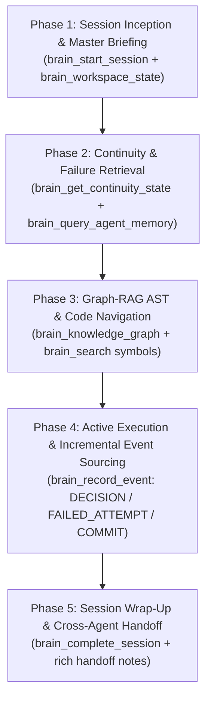

# Second Brain — Autonomous Agent Operating Protocol & Skill

The **Second Brain** is an external, persistent cognitive architecture. It unifies structured event memory, semantic vector retrieval, knowledge graphs, and cross-agent telemetry across all repositories and AI coding agents.

When you (Claude Code, OpenAI Codex, Qwen, Cursor, or Antigravity) interact with a codebase connected to Second Brain, **you are not operating in isolation**. You have direct, low-latency access to the accumulated architectural decisions, failed attempts, call graphs, and handoff notes of every agent and human engineer that worked before you.

---

## 1. Architectural Foundation & Multi-Engine Topology

```text
 ┌────────────────────────────────────────────────────────────────────────────────────────┐
 │                              AI CODING AGENTS                                          │
 │       Claude Code      •      OpenAI Codex      •      Cursor      •      Qwen         │
 └──────────────────────────────────────────┬─────────────────────────────────────────────┘
                                            │ MCP Protocol / REST API
                                            ▼
 ┌────────────────────────────────────────────────────────────────────────────────────────┐
 │                           SECOND BRAIN TRANSACTION ENGINE                              │
 │   ┌───────────────────────┐   ┌───────────────────────┐   ┌────────────────────────┐   │
 │   │     AgentSession      │   │      AgentEvent       │   │      AgentOutbox       │   │
 │   │ (IN_PROGRESS/COMPLETE)│   │(Ordered Sequence 1..N)│   │  (Idempotent & Async)  │   │
 │   └───────────┬───────────┘   └───────────┬───────────┘   └───────────┬────────────┘   │
 │               │                           │                           │                │
 │               └───────────────────────────┼───────────────────────────┘                │
 │                                           ▼                                            │
 │                               POSTGRESQL SOURCE OF TRUTH                               │
 │                                 (Serializable / ACID)                                  │
 └───────────────────────────────────────────┬────────────────────────────────────────────┘
                                             │ Background Outbox Worker (SKIP LOCKED)
                                             ▼
 ┌────────────────────────────────────────────────────────────────────────────────────────┐
 │                              PROJECTION & STORAGE ENGINES                              │
 │   ┌───────────────────────┐   ┌───────────────────────┐   ┌────────────────────────┐   │
 │   │    Neo4j Knowledge    │   │     Qdrant Vector     │   │      Redis / MinIO     │   │
 │   │  Graph & Call Chains  │   │   Decision & Attempt  │   │   Hot Caches & Diagram │   │
 │   │   (:Agent)-[:MADE]    │   │      Semantic RAG     │   │      Artifact Store    │   │
 │   └───────────────────────┘   └───────────────────────┘   └────────────────────────┘   │
 └────────────────────────────────────────────────────────────────────────────────────────┘
```

---

## 2. Standard 5-Phase Agent Cognitive Loop

Every agent working with Second Brain MUST follow this 5-phase loop to guarantee zero context loss across agent handoffs:



---

### Phase 1: Session Inception & Workspace Briefing (Start of Turn)

1. **Start Incremental Session**:
   Register your active session immediately upon receiving a user prompt or agent handoff:
   ```json
   {
     "tool": "brain_start_session",
     "args": {
       "agent_name": "Claude Code",
       "task": "Migrate JWT authentication to Redis distributed token store",
       "repository_id": "automorium-backend"
     }
   }
   ```
   *Yields*: `sessionId` and `sessionStatus = "IN_PROGRESS"`. Keep `sessionId` in your working memory.

2. **Retrieve Master Workspace Briefing (1-Shot)**:
   Obtain the repository overview, branch status, latest handoff, recent failures, and open tasks in **1 single call**:
   ```json
   {
     "tool": "brain_workspace_state",
     "args": {
       "repository": "automorium-backend"
     }
   }
   ```

---

### Phase 2: Historical Continuity & Failure Avoidance

Before planning code edits or migrations, search past agent memory to avoid repeating known pitfalls:

1. **Recall Past Failed Attempts**:
   ```json
   {
     "tool": "brain_get_attempts",
     "args": {
       "repository_id": "automorium-backend",
       "limit": 10
     }
   }
   ```
   *Critical Rule*: If a previous agent (e.g. Codex or Cursor) attempted a solution that produced `status = "FAILED"`, inspect the `lessonLearned` and `errorMessage` before attempting a similar direction.

2. **Semantic Memory & Decision Search**:
   ```json
   {
     "tool": "brain_search",
     "args": {
       "query": "Redis token blacklist clustering invalidation",
       "collection": "agent_memory"
     }
   }
   ```

---

### Phase 3: Graph-RAG AST & Structural Code Intelligence

Avoid reading hundreds of source files into your LLM context window. Query the AST graph directly:

1. **Symbol Search**:
   Find exact method declarations, class signatures, and route handlers:
   ```json
   {
     "tool": "brain_search",
     "args": {
       "query": "JwtAuthenticationFilter validateToken",
       "collection": "code_symbols"
     }
   }
   ```

2. **Knowledge Graph Call-Chain Traversal**:
   Trace callers, callees, and impacted dependencies:
   ```json
   {
     "tool": "brain_knowledge_graph",
     "args": {
       "label": "Function",
       "id": "com.secondbrain.service.AuthService.login",
       "depth": 2
     }
   }
   ```

3. **Breaking Change Impact Analysis**:
   Before modifying a core interface or shared entity:
   ```json
   {
     "tool": "brain_impact_analysis",
     "args": {
       "file_path": "src/main/java/com/secondbrain/service/AuthService.java",
       "diff": "..."
     }
   }
   ```

---

### Phase 4: Active Execution & Incremental Event Sourcing

As you work, stream incremental events into the durable PostgreSQL log. Second Brain's Outbox engine will asynchronously project them to Neo4j and Qdrant in the background.

1. **When a Significant Decision is Made**:
   ```json
   {
     "tool": "brain_record_event",
     "args": {
       "session_id": "<SESSION_UUID>",
       "event_type": "DECISION",
       "decision": {
         "title": "Redis-backed Sliding Window Token Revocation",
         "rationale": "In-memory token blacklist cannot scale horizontally across multi-instance pods"
       }
     }
   }
   ```

2. **When a Trial or Test Produces an Error**:
   *Do NOT discard failures silently.* Recording failures prevents subsequent prompts and peer agents from looping into the same dead end:
   ```json
   {
     "tool": "brain_record_event",
     "args": {
       "session_id": "<SESSION_UUID>",
       "event_type": "FAILED_ATTEMPT",
       "failed_attempt": {
         "task": "Multi-instance clustering test",
         "approach": "In-memory ConcurrentHashMap blacklist",
         "errorMessage": "Tokens invalidated on Pod A still accepted by Pod B",
         "lessonLearned": "Requires distributed key-value store with atomic Redis TTL expiration"
       }
     }
   }
   ```

3. **When Files are Touched or Commits are Produced**:
   ```json
   {
     "tool": "brain_record_event",
     "args": {
       "session_id": "<SESSION_UUID>",
       "event_type": "FILE_TOUCHED",
       "file_path": "src/main/java/com/secondbrain/config/RedisConfig.java"
     }
   }
   ```
   ```json
   {
     "tool": "brain_record_event",
     "args": {
       "session_id": "<SESSION_UUID>",
       "event_type": "COMMIT",
       "commit": {
         "hash": "3a9f0e1",
         "message": "feat(auth): configure Redis clustered connection factory"
       }
     }
   }
   ```

---

### Phase 5: Session Wrap-Up & Cross-Agent Handoff (End of Turn)

Always conclude your session cleanly by writing structured handoff notes for the next agent:

```json
{
  "tool": "brain_complete_session",
  "args": {
    "session_id": "<SESSION_UUID>",
    "status": "COMPLETED",
    "summary": "Completed Redis token store configuration and updated JwtFilter.",
    "handoff": {
      "targetAgent": "Codex",
      "task": "JWT Redis Token Rotation",
      "completedItems": "RedisConfig, JwtFilter token check, and AuthService token rotation",
      "inProgressItems": "Integration test suite for expired refresh token rejection",
      "blockedItems": "None",
      "nextSteps": "Add multi-instance test verifying expired refresh token rejection in Redis mock"
    }
  }
}
```

---

## 3. Comprehensive MCP Tool Reference

| MCP Tool Name | Description & Use Case | Key Arguments |
| :--- | :--- | :--- |
| `brain_start_session` | Begins an incremental agent session with durable sequence tracking. | `agent_name`, `task`, `repository_id`, `project_id` |
| `brain_workspace_state` | 1-shot master workspace briefing (repo, handoffs, failures, decisions). | `repository`, `project` |
| `brain_record_event` | Durable append-only event (`DECISION`, `FAILED_ATTEMPT`, `COMMIT`, `FILE_TOUCHED`). | `session_id`, `event_type`, `decision`, `failed_attempt`, `commit`, `file_path` |
| `brain_complete_session` | Concludes active session with status (`COMPLETED`/`FAILED`) and handoff payload. | `session_id`, `status`, `summary`, `handoff` |
| `brain_get_handoff` | Fetches the most recent handoff briefing for a repository. | `repository_id` |
| `brain_get_agent_timeline` | Retrieves chronological timeline of all agents' sessions and achievements. | `repo`, `limit` |
| `brain_get_attempts` | Queries recent failed and successful attempts with lessons learned. | `repository_id`, `limit` |
| `brain_search` | Hybrid semantic vector search across 6 specialized collections. | `query`, `collection` (`code_symbols`, `agent_memory`, `documentation`), `limit` |
| `brain_knowledge_graph` | Graph traversal for classes, functions, and endpoints. | `label`, `id`, `depth` |
| `brain_impact_analysis` | Evaluates blast radius and downstream callers of a diff. | `file_path`, `diff` |
| `brain_review_changes` | Graph-augmented automated code review on current working tree. | `working_tree_diff` |
| `brain_store_memory` | Saves high-level architectural memory or developer preference. | `content`, `type`, `scope`, `tags` |
| `brain_record_decision` | Directly records standalone architectural decision. | `title`, `rationale`, `project_id`, `repository_id` |
| `brain_doctor` | Runs deep multi-service health and diagnostic check. | *None* |

---

## 4. Agent Best Practices & Operational Invariants

### ✅ Mandatory Rules:
1. **Always start a session** with `brain_start_session` at the beginning of non-trivial tasks.
2. **Read previous handoffs** (`brain_workspace_state` or `brain_get_handoff`) to continue seamlessly from the exact state where the previous agent stopped.
3. **Record every failed attempt** (`FAILED_ATTEMPT`) with a concise `lessonLearned` before attempting an alternative approach.
4. **Write explicit next steps in your handoff** (`brain_complete_session`) so the incoming agent knows precisely which files to edit next.

### ❌ Prohibited Patterns:
1. **Do NOT guess repository architecture** by grepping thousands of files when Neo4j call graphs (`brain_knowledge_graph`) and symbol vectors (`brain_search`) give exact relations.
2. **Do NOT repeat known failing trials** without modifying the approach based on recorded lessons.
3. **Do NOT leave an active session hanging** without calling `brain_complete_session`.
