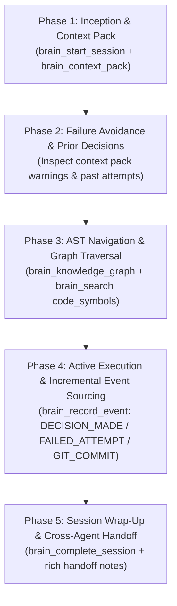

# Second Brain — Autonomous Agent Operating Protocol & Skill

The **Second Brain** is an external, persistent cognitive architecture. It unifies structured event memory, semantic vector retrieval, knowledge graphs, and cross-agent telemetry across all repositories and AI coding agents.

When you (Claude Code, OpenAI Codex, Qwen, Cursor, or Antigravity) interact with a codebase connected to Second Brain, **you are not operating in isolation**. You have direct, low-latency access to the accumulated architectural decisions, failed attempts, call graphs, and handoff notes of every agent and human engineer that worked before you.

---

## 1. Architectural Foundation & Multi-Engine Topology

```text
 ┌────────────────────────────────────────────────────────────────────────────────────────┐
 │                              AI CODING AGENTS                                          │
 │       Claude Code      •      OpenAI Codex      •      Cursor      •      Qwen         │
 └──────────────────────────────────────────┬─────────────────────────────────────────────┘
                                            │ MCP Protocol / REST API
                                            ▼
 ┌────────────────────────────────────────────────────────────────────────────────────────┐
 │                           SECOND BRAIN TRANSACTION ENGINE                              │
 │   ┌───────────────────────┐   ┌───────────────────────┐   ┌────────────────────────┐   │
 │   │     AgentSession      │   │      AgentEvent       │   │      AgentOutbox       │   │
 │   │ (IN_PROGRESS/COMPLETE)│   │(Ordered Sequence 1..N)│   │  (Idempotent & Async)  │   │
 │   └───────────┬───────────┘   └───────────┬───────────┘   └───────────┬────────────┘   │
 │               │                           │                           │                │
 │               └───────────────────────────┼───────────────────────────┘                │
 │                                           ▼                                            │
 │                               POSTGRESQL SOURCE OF TRUTH                               │
 │                                 (Serializable / ACID)                                  │
 └───────────────────────────────────────────┬────────────────────────────────────────────┘
                                             │ Background Outbox Worker (SKIP LOCKED)
                                             ▼
 ┌────────────────────────────────────────────────────────────────────────────────────────┐
 │                              PROJECTION & STORAGE ENGINES                              │
 │   ┌───────────────────────┐   ┌───────────────────────┐   ┌────────────────────────┐   │
 │   │    Neo4j Knowledge    │   │     Qdrant Vector     │   │      Redis / MinIO     │   │
 │   │  Graph & Call Chains  │   │   Decision & Attempt  │   │   Hot Caches & Diagram │   │
 │   │   (:Agent)-[:MADE]    │   │      Semantic RAG     │   │      Artifact Store    │   │
 │   └───────────────────────┘   └───────────────────────┘   └────────────────────────┘   │
 └────────────────────────────────────────────────────────────────────────────────────────┘
```

---

## 2. Adaptive Retrieval Escalation Policy & Query Budgeting

Do **not** query every brain database for trivial tasks. Calibrate your context retrieval using this 6-tier escalation policy:

```text
┌─────────┬───────────────────────────────┬────────────────────────────────────────┬──────────────┐
│ Level   │ Scenario                      │ Recommended MCP Calls                  │ Query Budget │
├─────────┼───────────────────────────────┼────────────────────────────────────────┼──────────────┤
│ Level 0 │ Local / isolated single-file  │ (No retrieval needed)                  │ 0 calls      │
│         │ edit with obvious context     │                                        │              │
│ Level 1 │ Task start / continuity pickup│ brain_context_pack (or workspace_state)│ 1 call       │
│ Level 2 │ Prior decisions & failures    │ brain_get_attempts / query_agent_memory│ 1-2 calls    │
│ Level 3 │ Navigating unfamiliar symbols │ brain_search(collection="code_symbols")│ 1-2 calls    │
│ Level 4 │ Deep refactoring / call paths │ brain_knowledge_graph                  │ 1-2 calls    │
│ Level 5 │ Breaking schema / API change  │ brain_impact_analysis                  │ 1 call       │
└─────────┴───────────────────────────────┴────────────────────────────────────────┴──────────────┘
```

### Query Budget Guidelines:
- **Simple Tasks** (typo fix, small unit test, single function refactor): Max **1–2** brain calls. Default to `brain_context_pack`.
- **Medium Tasks** (new endpoint, database migration, component addition): Max **3–5** brain calls.
- **Complex / Architectural Tasks** (cross-service refactor, distributed storage, auth overhaul): Adaptive / unconstrained.

---

## 3. Standard 5-Phase Agent Cognitive Loop

For any multi-step engineering task, follow this standard loop:



---

### Phase 1: Inception & 1-Shot Context Pack (Start of Task)

*Note: Start a session only when performing real repository/project engineering tasks or continuing an agent handoff — not for one-off general questions.*

1. **Start Incremental Session**:
   ```json
   {
     "tool": "brain_start_session",
     "args": {
       "agent_name": "Claude Code",
       "task": "Migrate JWT authentication to Redis distributed token store",
       "repository_id": "automorium-backend"
     }
   }
   ```
   *Yields*: `sessionId` and `sessionStatus = "IN_PROGRESS"`. Keep `sessionId` in your working memory.

2. **Retrieve 1-Shot Multi-Modal Context Pack**:
   Get repository metadata, git status, active sessions, latest handoff, past failures, relevant decisions, open tasks, and intelligent automated warnings in **1 single call**:
   ```json
   {
     "tool": "brain_context_pack",
     "args": {
       "task": "Migrate JWT authentication to Redis distributed token store",
       "repository": "automorium-backend"
     }
   }
   ```

---

### Phase 2: Failure Avoidance & Prior Decisions

Before modifying code or guessing architecture, inspect the `warnings` and `relevantFailures` returned in your context pack:

1. **Inspect Failure Lessons**:
   If `brain_context_pack` returns a warning or you need more failure details:
   ```json
   {
     "tool": "brain_get_attempts",
     "args": {
       "repository_id": "automorium-backend",
       "limit": 5
     }
   }
   ```
   *Rule*: If a previous attempt by Claude, Codex, or Cursor failed, read `lessonLearned` and `errorMessage` before choosing your approach.

2. **Long-Term Memory vs Session Events**:
   - **Session Events** (`brain_record_event`): Use for actions, decisions, and failures that occurred during your active session.
   - **Direct Memory** (`brain_store_memory`): Use for standalone, durable guidelines or developer preferences independent of a specific session.

---

### Phase 3: Graph-RAG AST & Structural Code Intelligence

Avoid reading hundreds of source files into your context window. Use vector symbol search and graph traversal:

1. **Symbol Search**:
   Find exact method signatures and class definitions:
   ```json
   {
     "tool": "brain_search",
     "args": {
       "query": "JwtAuthenticationFilter validateToken",
       "collection": "code_symbols"
     }
   }
   ```

2. **Call-Chain Traversal**:
   Trace callers, callees, and impacted dependencies:
   ```json
   {
     "tool": "brain_knowledge_graph",
     "args": {
       "label": "Function",
       "id": "com.secondbrain.service.AuthService.login",
       "depth": 2
     }
   }
   ```

3. **Breaking Change Impact Analysis**:
   Before modifying a core interface or shared data model:
   ```json
   {
     "tool": "brain_impact_analysis",
     "args": {
       "file_path": "src/main/java/com/secondbrain/service/AuthService.java",
       "diff_or_code": "..."
     }
   }
   ```

---

### Phase 4: Active Execution & Incremental Event Sourcing

Stream canonical events into the durable log as you work:

1. **Canonical Event Names**:
   - `DECISION_MADE`: Architectural or structural decisions
   - `FAILED_ATTEMPT`: Trials or test executions that failed
   - `PROBLEM_DISCOVERED`: New blockers, bugs, or limitations discovered
   - `FILE_TOUCHED`: Materially modified source files relevant for handoff
   - `GIT_COMMIT`: Canonical Git commits produced

2. **When an Architectural Decision is Made**:
   ```json
   {
     "tool": "brain_record_event",
     "args": {
       "session_id": "<SESSION_UUID>",
       "event_type": "DECISION_MADE",
       "decision": {
         "title": "Redis-backed Sliding Window Token Revocation",
         "rationale": "In-memory token blacklist cannot scale horizontally across multi-instance pods"
       }
     }
   }
   ```

3. **When an Approach or Test Fails**:
   *Do NOT discard failures silently.*
   ```json
   {
     "tool": "brain_record_event",
     "args": {
       "session_id": "<SESSION_UUID>",
       "event_type": "FAILED_ATTEMPT",
       "failed_attempt": {
         "task": "Multi-instance clustering test",
         "approach": "In-memory ConcurrentHashMap blacklist",
         "errorMessage": "Tokens invalidated on Pod A still accepted by Pod B",
         "lessonLearned": "Requires distributed key-value store with atomic Redis TTL expiration"
       }
     }
   }
   ```

4. **When Committing Code (Use Full 40-Character SHA)**:
   ```json
   {
     "tool": "brain_record_event",
     "args": {
       "session_id": "<SESSION_UUID>",
       "event_type": "GIT_COMMIT",
       "commit": {
         "hash": "3a9f0e1b8c2d4e5f6a7b8c9d0e1f2a3b4c5d6e7f",
         "message": "feat(auth): configure Redis clustered connection factory"
       }
     }
   }
   ```

---

### Phase 5: Session Wrap-Up & Cross-Agent Handoff (End of Turn)

Always conclude your session cleanly by writing structured handoff notes for the next agent:

```json
{
  "tool": "brain_complete_session",
  "args": {
    "session_id": "<SESSION_UUID>",
    "status": "COMPLETED",
    "summary": "Configured Redis clustered connection factory and integrated sliding window revocation in JwtFilter.",
    "handoff": {
      "targetAgent": "Codex",
      "task": "JWT Redis Token Rotation",
      "completedItems": "RedisConfig, JwtFilter token check, and AuthService token rotation",
      "inProgressItems": "Integration test suite for expired refresh token rejection",
      "blockedItems": "None",
      "nextSteps": "Add multi-instance test verifying expired refresh token rejection in Redis mock"
    }
  }
}
```

---

## 4. Comprehensive MCP Tool Reference

| MCP Tool Name | Description & Use Case | Key Arguments |
| :--- | :--- | :--- |
| `brain_context_pack` | **Flagship 1-Shot Multi-Modal Briefing**: Assembles repo state, handoffs, decisions, failures, warnings, and next steps in 1 call. | `task`, `repository`, `project` |
| `brain_start_session` | Begins an incremental agent session with durable sequence tracking. | `agent_name`, `task`, `repository_id`, `project_id` |
| `brain_record_event` | Durable append-only event (`DECISION_MADE`, `FAILED_ATTEMPT`, `PROBLEM_DISCOVERED`, `FILE_TOUCHED`, `GIT_COMMIT`). | `session_id`, `event_type`, `decision`, `failed_attempt`, `commit`, `file_path` |
| `brain_complete_session` | Concludes active session with status (`COMPLETED`/`FAILED`) and handoff payload. | `session_id`, `status`, `summary`, `handoff` |
| `brain_workspace_state` | Master workspace briefing (repositories, active sessions, open tasks). | `project`, `repository` |
| `brain_get_handoff` | Fetches the most recent handoff briefing for a repository. | `repository_id` |
| `brain_get_agent_timeline` | Retrieves chronological timeline of all agents' sessions and achievements. | `repo`, `limit` |
| `brain_get_attempts` | Queries recent failed and successful attempts with lessons learned. | `repository_id`, `limit` |
| `brain_search` | Hybrid semantic vector search across 6 specialized collections (`code_symbols`, `agent_memory`, `documentation`). | `query`, `collection`, `limit` |
| `brain_knowledge_graph` | Graph traversal for classes, functions, and endpoints. | `label`, `id`, `depth` |
| `brain_impact_analysis` | Evaluates blast radius and downstream callers of a diff. | `file_path`, `diff_or_code`, `project_id` |
| `brain_review_changes` | Graph-augmented automated code review on current working tree. | `working_tree_diff`, `project_id`, `repository_id` |
| `brain_store_memory` | Saves high-level architectural memory or developer preference. | `content`, `type`, `scope`, `tags` |
| `brain_doctor` | Runs deep multi-service health and diagnostic check. | *None* |

---

## 5. Agent Best Practices & Operational Invariants

### ✅ Mandatory Rules:
1. **Use `brain_context_pack` first** at the start of any multi-step task to obtain immediate, full context.
2. **Follow the retrieval escalation policy**: don't flood the context window with unnecessary graph queries for small local fixes.
3. **Record every failed trial** (`FAILED_ATTEMPT`) with clear lessons learned before switching approaches.
4. **Use full 40-character Git SHAs** when logging `GIT_COMMIT` events.
5. **Always conclude with `brain_complete_session`** and provide explicit `nextSteps` in the handoff for the incoming agent.
